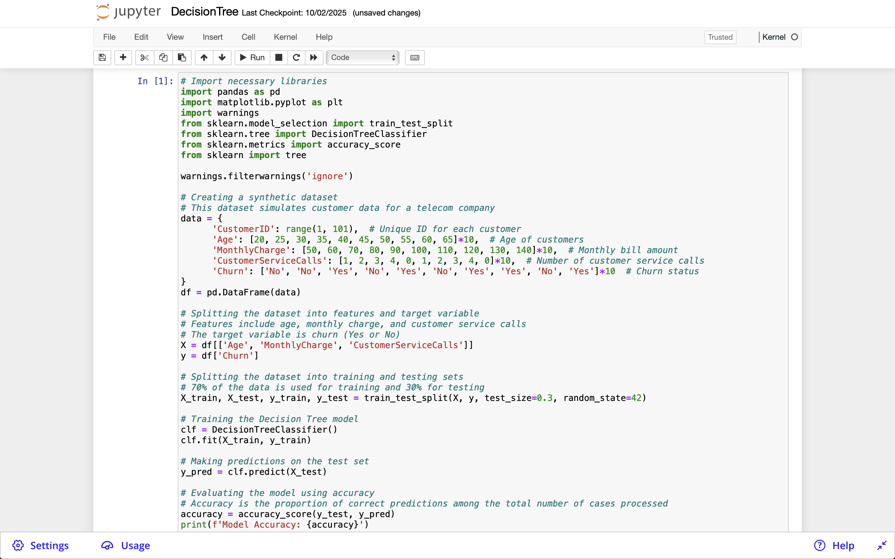
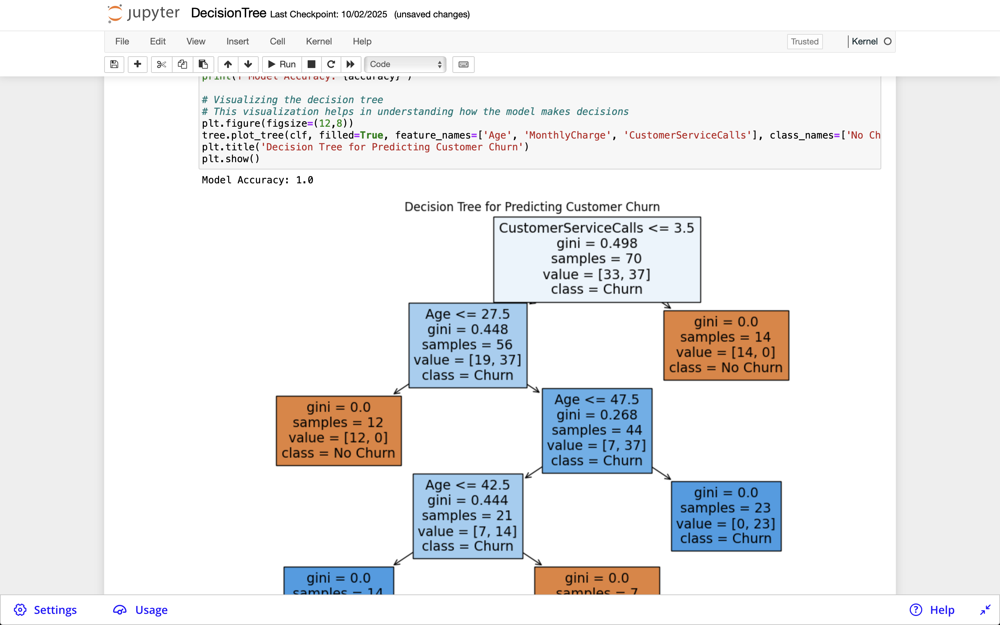

## Building a Decision Tree to Predict Customer Churn
Imagine you are a data analyst at a telecom company. The marketing department has noticed an increase in customer churn and needs your help to identify which customers are most likely to leave next month.

Your Tasks
In this exercise, you will build a decision tree model to predict customer churn for a telecom company. Customer churn refers to when a customer stops doing business with a company. Predicting churn is crucial for businesses to retain customers by addressing their issues proactively.

Copy the code below on this page and paste it into a notebook cell in the Jupyter Notebook below, then run the cell
Dataset Description
We will use a synthetic dataset for this exercise. The dataset contains the following columns:

CustomerID: A unique identifier for each customer.
Age: The age of the customer.
MonthlyCharge: The monthly bill amount for the customer.
CustomerServiceCalls: The number of times the customer contacted customer service.
Churn: This is our target variable, indicating whether the customer churned (Yes) or not (No).

## Step-by-Step Instructions
Setup the Environment:
Import necessary libraries: Pandas for data manipulation, Scikit-learn for machine learning, and Matplotlib for visualization.
Create the Dataset:
Use Python to create a synthetic dataset. We'll make a small dataset for simplicity.
Data Preparation:
Split the data into features (X) and the target variable (y).
Further split the dataset into training and testing sets.
Build the Decision Tree Model:
Use Scikit-learn to create a DecisionTreeClassifier.
Train the model on the training data.
Evaluate the Model:
Make predictions on the test set.
Calculate the accuracy of the model.
Visualize the Decision Tree:
Use Matplotlib to visualize how the decision tree makes decisions.
Discuss the Results:
Interpret the decision tree.
Discuss how it can be used by the company to reduce customer churn.


```
# Import necessary libraries
import pandas as pd
import matplotlib.pyplot as plt
import warnings
from sklearn.model_selection import train_test_split
from sklearn.tree import DecisionTreeClassifier
from sklearn.metrics import accuracy_score
from sklearn import tree

warnings.filterwarnings('ignore')

# Creating a synthetic dataset
# This dataset simulates customer data for a telecom company
data = {
      'CustomerID': range(1, 101),  # Unique ID for each customer
      'Age': [20, 25, 30, 35, 40, 45, 50, 55, 60, 65]*10,  # Age of customers
      'MonthlyCharge': [50, 60, 70, 80, 90, 100, 110, 120, 130, 140]*10,  # Monthly bill amount
      'CustomerServiceCalls': [1, 2, 3, 4, 0, 1, 2, 3, 4, 0]*10,  # Number of customer service calls
      'Churn': ['No', 'No', 'Yes', 'No', 'Yes', 'No', 'Yes', 'Yes', 'No', 'Yes']*10  # Churn status
}
df = pd.DataFrame(data)

# Splitting the dataset into features and target variable
# Features include age, monthly charge, and customer service calls
# The target variable is churn (Yes or No)
X = df[['Age', 'MonthlyCharge', 'CustomerServiceCalls']]
y = df['Churn']

# Splitting the dataset into training and testing sets
# 70% of the data is used for training and 30% for testing
X_train, X_test, y_train, y_test = train_test_split(X, y, test_size=0.3, random_state=42)

# Training the Decision Tree model
clf = DecisionTreeClassifier()
clf.fit(X_train, y_train)

# Making predictions on the test set
y_pred = clf.predict(X_test)

# Evaluating the model using accuracy
# Accuracy is the proportion of correct predictions among the total number of cases processed
accuracy = accuracy_score(y_test, y_pred)
print(f'Model Accuracy: {accuracy}')

# Visualizing the decision tree
# This visualization helps in understanding how the model makes decisions
plt.figure(figsize=(12,8))
tree.plot_tree(clf, filled=True, feature_names=['Age', 'MonthlyCharge', 'CustomerServiceCalls'], class_names=['No Churn', 'Churn'])
plt.title('Decision Tree for Predicting Customer Churn')
plt.show()

```

# Result





